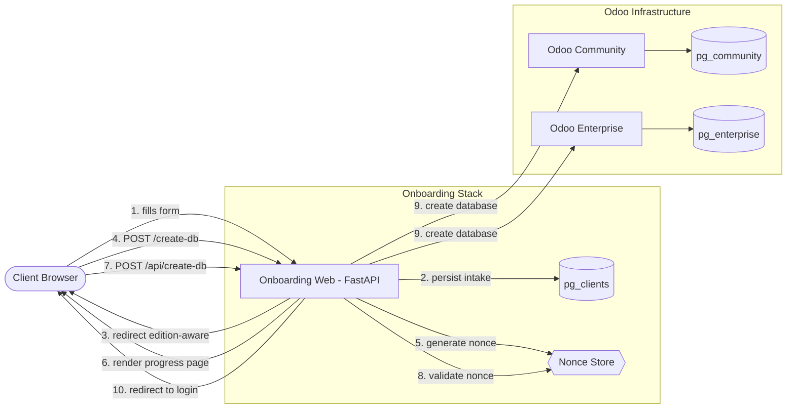

# Odoo 18 Onboarding Stack

A containerized FastAPI + Odoo stack to **collect client details, provision Odoo databases (Community & Enterprise), and redirect users to their instance**. Designed for Savanna Solutions' SaaS model.

---

## Highlights

- **Two Odoo editions** — Community & Enterprise, each with its own Postgres
- **Onboarding Web (FastAPI)** — 2-step intake form → edition-aware Odoo DB creation
- **Direct synchronous provisioning** — web app calls Odoo's `/web/database/create` directly (no Redis/Celery needed for the happy path; queue worker included for extensibility)
- **Nonce-gated API** — one-time-use tokens prevent replay on the DB creation endpoint
- **Auto-migration** — schema adapts to legacy columns on startup
- **Dark theme UI** — brandable Savanna night theme
- **Docker Compose profiles** — `core` (Odoo + Postgres) and `onboarding` (web + clients DB) for flexible deployment

---

## Architecture



### URL Pattern (recommended for production)

| Purpose | URL |
|---------|-----|
| Onboarding portal | `https://onboard.example.com` |
| Odoo (per DB) | `https://enter.example.com/web/login?db=<db_name>` |
| Vanity client subdomain | `https://<client>.example.com` → Nginx → Odoo |

> **Note:** Vanity subdomains require wildcard DNS and Nginx templating/automation.

---

## Repository Layout

```
.
├── clients_schema.sql              # SQL schema for pg_clients (clients table)
├── docker-compose.yml              # Core + onboarding services
├── addons_paths.txt                # Notes on Odoo addons mounts
├── onboarding_web/
│   └── app/
│       ├── Dockerfile
│       ├── main.py                 # FastAPI app: routes, ORM, migrations
│       ├── requirements.txt
│       ├── static/
│       │   └── sslogo.png          # Branding asset
│       └── templates/
│           ├── base.html           # Shared layout (dark Bootstrap theme)
│           ├── form.html           # Step 1: company info, domain, edition
│           ├── database.html       # Step 2: DB password, lang, country
│           ├── creating_db.html    # Progress page with JS → /api/create-db
│           ├── success.html        # Post-creation success page
│           ├── error.html          # Error page (renders message + details)
│           └── admin_clients.html  # Admin list of onboarded clients
├── onboarding_worker/
│   ├── Dockerfile
│   ├── requirements.txt
│   └── tasks/
│       ├── __init__.py             # Celery app + task definition
│       └── odoo_provision.py       # odoorpc-based company provisioning
├── odoo/                           # (gitignored) Odoo config dirs
│   ├── community/odoo.conf
│   └── enterprise/odoo.conf
├── .env.example (see below)
├── .gitignore
└── README.md
```

---

## Quick Start (Local)

### Prerequisites

- Docker 20+ with Compose v2
- Git

### Setup

```bash
git clone https://github.com/<your-org>/odoo18-onboard-stack.git
cd odoo18-onboard-stack
```

Create `.env` in the project root:

```dotenv
# ── Core ──
MASTER_PASSWORD=change_me_strong

# Onboarding DB (clients)
DATABASE_URL=postgresql://clientadmin:clientpass@pg_clients/clients

# Odoo internal URLs (Docker network)
ODOO_COMMUNITY_URL=http://odoo_community:8069
ODOO_ENTERPRISE_URL=http://odoo_enterprise:8069

# Odoo public URLs (browser-facing)
ODOO_COMMUNITY_EXTERNAL=http://localhost:8069
ODOO_ENTERPRISE_EXTERNAL=http://localhost:8070

# Debug
ONBOARD_DEBUG=0
```

### Run

```bash
# Start Odoo + Postgres (core)
docker compose --profile core up -d

# Start onboarding web + clients DB
docker compose --profile onboarding up -d --build
```

### Visit

| Service | URL |
|---------|-----|
| Onboarding portal | `http://localhost:8000` |
| Odoo Community | `http://localhost:8069` |
| Odoo Enterprise | `http://localhost:8070` |
| Admin clients view | `http://localhost:8000/admin/clients` |

---

## Onboarding Flow

1. **Step 1** (`/`) — Client fills in company name, DB name, admin email, domain name preference (Y/N), and selects Community or Enterprise edition.
2. **Step 2** (`/database/{edition}`) — DB name is shown read-only. User sets password, language, country, demo data toggle, then clicks "Create Database".
3. **Creating page** (`/create-db`) — Server validates inputs, checks if DB already exists (redirects to login if so), generates a one-time nonce, and renders a progress page.
4. **API call** (`POST /api/create-db`) — Client-side JavaScript POSTs the payload + nonce. The server validates the nonce, calls Odoo's `/web/database/create` with the master password, and on success redirects the browser to `/web/login?db=<name>`.
5. **Persistence** — All intake data is stored in `pg_clients.clients` (via SQLAlchemy) for audit and the admin view.

---

## Configuration Reference

### Environment Variables

| Variable | Default | Purpose |
|----------|---------|---------|
| `MASTER_PASSWORD` | `admin` | Odoo master password for DB creation. **Set a strong value in `.env`. Never expose to clients.** |
| `DATABASE_URL` | `postgresql://clientadmin:clientpass@pg_clients/clients` | Onboarding intake Postgres connection string |
| `ODOO_COMMUNITY_URL` | `http://odoo_community:8069` | Community Odoo internal address (Docker network) |
| `ODOO_ENTERPRISE_URL` | `http://odoo_enterprise:8069` | Enterprise Odoo internal address |
| `ODOO_COMMUNITY_EXTERNAL` | `http://localhost:8069` | Community Odoo public-facing URL (browser redirect) |
| `ODOO_ENTERPRISE_EXTERNAL` | `http://localhost:8070` | Enterprise Odoo public-facing URL |
| `ONBOARD_DEBUG` | `0` | Set to `1` for debug logging |

### Database Schema (`pg_clients.clients`)

| Column | Type | Notes |
|--------|------|-------|
| `id` | `SERIAL PRIMARY KEY` | Auto-increment |
| `company_name` | `VARCHAR(255) NOT NULL` | From step 1 |
| `admin_email` | `VARCHAR(255) NOT NULL` | Admin login email |
| `odoo_edition` | `VARCHAR(50) NOT NULL` | `Community` or `Enterprise` |
| `db_name` | `VARCHAR(63) NOT NULL` | Lowercase, alphanumeric + underscores |
| `domain_name` | `BOOLEAN NOT NULL DEFAULT false` | Whether client has a custom domain |
| `name_domain_name` | `VARCHAR(255)` | Optional custom domain value |
| `created_at` | `TIMESTAMPTZ DEFAULT NOW()` | Auto-set on insert |

---

## API Endpoints

| Method | Path | Description |
|--------|------|-------------|
| `GET` | `/` | Step 1 onboarding form |
| `POST` | `/submit` | Submit intake → redirect to step 2 |
| `GET` | `/database/community` | Step 2 form (Community) |
| `GET` | `/database/enterprise` | Step 2 form (Enterprise) |
| `POST` | `/create-db` | Validate + render "Creating…" page |
| `POST` | `/api/create-db` | **Create Odoo DB** (JSON, nonce-gated) |
| `GET` | `/admin/clients` | Admin list of all clients |
| `GET` | `/success` | Generic success page |
| `GET` | `/error` | Generic error page |
| `GET` | `/healthz` | Health check (returns `{"status": "ok"}`) |

### `/api/create-db` Request Body

```json
{
  "db_name": "savanna_client",
  "db_password": "securepass123",
  "phone": "+260966662326",
  "lang": "en_US",
  "country": "ZM",
  "demo": false,
  "edition": "Enterprise",
  "admin_login": "admin@client.com",
  "nonce": "<one-time-token>"
}
```

### `/api/create-db` Response

```json
// Success
{"ok": true, "redirect": "http://localhost:8070/web/login?db=savanna_client"}
// Error
{"ok": false, "error": "Expired or invalid request (nonce)."}
```

---

## Common Operations

### Admin Clients View

Secure `/admin/clients` with one or more of: basic auth (Nginx), IP allowlist, or JWT session.

```sql
-- List recent clients
SELECT id, company_name, admin_email, odoo_edition, db_name, created_at
FROM clients
ORDER BY created_at DESC;
```

### Rebuild Odoo Web Assets

```bash
docker exec odoo_community odoo -d <DB_NAME> -u all --stop-after-init
docker exec odoo_enterprise odoo -d <DB_NAME> -u all --stop-after-init
```

### Fix Addon Permissions (host)

```bash
sudo chown -R 101:0 ./odoo/community/addons ./odoo/enterprise/addons
sudo chmod -R 775     ./odoo/community/addons ./odoo/enterprise/addons
```

### View Logs

```bash
docker compose logs -f onboarding_web
docker compose logs -f odoo_community
```

### Access Postgres

```bash
docker exec -it pg_clients psql -U clientadmin -d clients
docker exec -it pg_community psql -U odoo -d postgres
docker exec -it pg_enterprise psql -U odoo -d postgres
```

---

## Production Deployment Checklist

- [ ] Strong `MASTER_PASSWORD` in `.env`; never commit secrets
- [ ] Cloudflare DNS + TLS set to **Full (Strict)**
- [ ] Nginx reverse proxy with security headers, rate limiting, gzip
- [ ] PostgreSQL backups (daily + retained, test restores)
- [ ] Container health monitoring and disk space alerts
- [ ] Restrict `/web/database/manager` behind IP allowlist or auth
- [ ] Pin dependency versions in `requirements.txt` (open issue)

---

## Troubleshooting

| Symptom | Cause / Fix |
|---------|-------------|
| `role "odoo" does not exist` when connecting to `pg_clients` | Use `clientadmin`, not `odoo`. Each Postgres has its own users. |
| DB creation fails with `409 Conflict` | Nonce expired (5-min window). User must go back and re-submit. |
| Asset / icon issues | Rebuild Odoo assets (see above) and clear browser cache. |
| Custom module won't install | Fix permissions: `chown -R 101:0` on addons dir. Check module deps. |
| Enterprise features missing | Confirm on `odoo_enterprise` and valid licensing. |

---

## Security Notes

- Odoo master password is **never exposed** in HTML/JS; only used server-side for the backend API call
- DB creation is gated by a **one-time nonce** (5-min expiry, consumed on use)
- Odoo `/web/database/manager` should be restricted in production
- Enforce HTTPS end-to-end; prefer Cloudflare WAF + rate limiting
- Keep base images updated; rebuild regularly

---

## Roadmap

- Automated vanity subdomain provisioning (DNS API + Nginx templating)
- Admin UI for queue status and client management
- One-click backup/restore per client DB
- Session store (Redis/cookies) instead of in-memory `_runtime_state`
- Dependency version pinning in all `requirements.txt`

---

## License

MIT

## Author

**Adam ChapChap Ng'uni** — IT Systems Administrator & Cybersecurity Consultant
